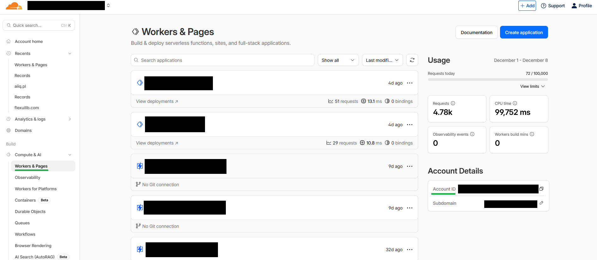
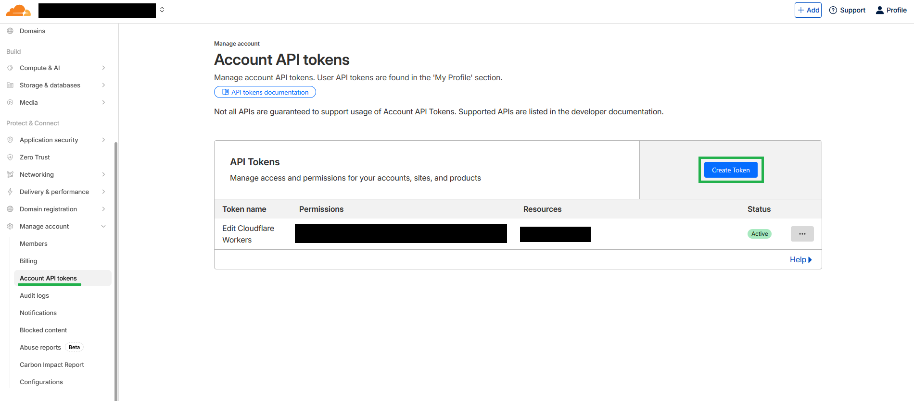
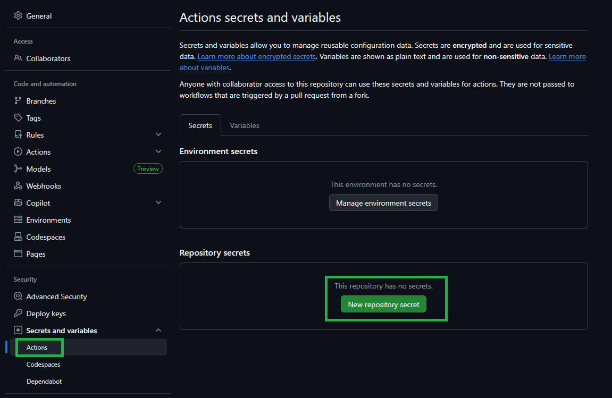

# `@nuxtlib/cf-deployment`

## Deploy your website to Cloudflare Workers with GitHub Actions in minutes, with multiple environments, configurations, and branches.

### 1. Install the module in your Nuxt project
```bash
npm install -D @nuxtlib/cf-deployment
```

### 2. Configure `cfDeployment` in `nuxt.config.ts`. (Minimal example)
```ts
export default defineNuxtConfig({
  modules: ['@nuxtlib/cf-deployment'],
  cfDeployment: {
    appName: 'your-app-name',
    environments: [
      { branch: 'main', url: 'example.com' },
      { branch: 'staging', url: 'staging.example.com' },
    ],
  },
})
```
### 3. Cloudflare setup:

1. In Cloudflare Dashboard, go to `Workers & Pages` and copy your `Account ID`.


2. In Cloudflare, go to `API Tokens` -> `Create Token` -> choose `Edit Cloudflare Workers`, scope it to your account, create the token, and copy it.


#### If your domain isn't registered in Clouflare yet
Go to Cloudflare, add your domain and point nameservers to Cloudflare. Wait until the zone is `Active`.


### 4. GitHub setup:
1. In GitHub, open `Settings` -> `Secrets and variables` -> `Actions`, then add repository secrets `CLOUDFLARE_ACCOUNT_ID` and `CLOUDFLARE_API_TOKEN`.

2. Optional - In GitHub, go to your repository `Settings` -> `Environments`, then create the environments used by your deployment flow.
3. Optional - For each GitHub environment, configure deployment branch restrictions.


### Final touch and Verification (CLI or dashboard)
Push to a configured branch and enjoy automatic deployment.


#### Preview the deploy

- In GitHub -> `Actions`, you should see a run start when you push to one of your configured branches. It installs dependencies, builds Nuxt, then calls Wrangler. A green run means the Worker was deployed.
- In Cloudflare -> `Build` -> `Compute & AI` -> `Workers & Pages`, you should now see two Workers named from your `wrangler.toml` (for each of your environments).
- In Cloudflare -> `Domain` -> `DNS` -> `Records`, two DNS records should point to the Workers (one for each environment). They appear after deploy and confirm the routes are attached to your domains.
- Propagation can take a few minutes. Once complete, you can hit your environment URLs in the browser and see your deployed app.

#### CLI (real-time)

From your project root, stream logs for each Worker:

```bash
npx wrangler tail your-environment-name
```

Hit your environment URL in the browser and you will see log entries in the terminal.

#### Dashboard

In Cloudflare -> `Workers & Pages` -> select your Worker -> use the `Logs` / `Observability` view to see requests and errors.

`cf-deployment` is a Cloudflare-first deployment layer for Nuxt apps.
It turns deployment from ad-hoc CI scripts into config-driven infrastructure generated from `cfDeployment` in `nuxt.config.ts`.

This module is for teams that want to stay deep in the Cloudflare ecosystem:

- Workers as the runtime
- Cloudflare routes/custom domains
- Cloudflare secrets and Wrangler environments
- GitHub Actions as the delivery pipeline

The goal is to keep deploy behavior explicit, repeatable, and versioned as your app and team scale.

## Why This Exists

Nuxt projects often begin with one environment and one deploy command, then quickly grow into:

- branch-based preview/staging/production flows
- multiple environment routes and naming rules
- package-manager-specific CI steps (`npm`, `pnpm`, or `yarn`)
- repeated edits to both `wrangler.toml` and workflow YAML

Without automation, those files drift apart. Branches deploy to wrong envs, route updates lag behind code, and CI behavior becomes inconsistent between repos.

`cf-deployment` solves that drift by generating deployment artifacts from one source of truth.

## Who It Is For

Use this module if your team:

- deploys Nuxt to Cloudflare Workers and wants config-as-code for deploy infrastructure
- needs reliable branch-to-environment mapping across `wrangler.toml` and GitHub Actions
- wants Cloudflare-native workflows without hand-maintaining YAML in every repository
- prefers owning deployment logic directly in the app repo instead of relying on hosted abstractions

It is especially useful for platform teams, agencies, and multi-project organizations that need consistent deploy behavior across many Nuxt services.

## Ecosystem Context

On July 8, 2025, Vercel announced that NuxtLabs (maintainers of Nuxt, Nitro, and NuxtHub) joined Vercel.

Nuxt remains open and deployable across providers, and many teams continue choosing Cloudflare for edge runtime, networking, and data products.
This module is built for that Cloudflare-first path: explicit Workers deploy control, reproducible CI, and infrastructure outputs you can audit in git.

## Cloudflare-First Strategy Fit

If your application stack is already centered on Cloudflare capabilities, deployment should follow the same model.
This module aligns deploy orchestration with that direction:

- compute at the edge with Workers
- domain/routing control through Cloudflare
- environment-aware Wrangler deploy targets
- CI-driven releases with explicit branch promotion rules

For teams standardizing on Cloudflare services like KV, R2, D1, Queues, or Durable Objects, keeping deploy control in-repo reduces cross-platform glue code and makes operational ownership clearer.

## What Problems It Solves

- Manual deploy config drift between app config, Wrangler, and CI
- Fragile branch deploy logic spread across copy-pasted workflow files
- Inconsistent install/build/deploy commands between package managers
- Hard-to-review infrastructure changes hidden in manual dashboard edits
- Growing operational overhead as environments and branches increase

## What It Generates

On every Nuxt setup build (`npx run dev`, `npx nuxt prepare`, `npx nuxt build`), the module rewrites:

- `wrangler.toml`
- `.github/workflows/deploy.yml`

This keeps Cloudflare config and GitHub Actions deploy automation in sync.


## Full configuration options example

```ts
export default defineNuxtConfig({
  modules: ['cf-deployment'],
  cfDeployment: {
    // Required name - Used as the `name` field in `wrangler.toml` and as a prefix for environment names.
    appName: 'my-app',
    
    // Required at least one environment - Each item generates a Wrangler environment and GitHub Actions deploy step.
    environments: [
      
      // Your primary environment, deploying from the main branch to the root domain.
      { branch: 'main', url: 'app.example.com', samplingRate: 0.2 }, 
      
      // Optional additional environments
      { branch: 'staging', url: 'staging.app.example.com', samplingRate: 1 }, 
      
      // Optional additional environments
      { branch: 'feature-1', url: 'feature-1.app.example.com'}, 
    ],
    
    // Optional [npm, pnpm, yarn]; default: 'npm' - Control how GitHub Actions install and deploy your app
    packageManager: 'npm', 
    
    // Optional - Control the Node version used in GitHub Actions; default: '24'
    nodeVersion: '24', 

  },
})
```


## Configuration

Set options under `cfDeployment` in `nuxt.config.ts`.

| Option | Required | Used in | Behavior |
| --- | --- | --- | --- |
| `appName` | No | `wrangler.toml` | Sets top-level `name` and prefixes each environment `name` |
| `environments` | No | Both | Drives Wrangler env blocks and workflow branch deploy targets |
| `environments[].branch` | Yes (per entry) | Both | Source branch and env key input |
| `environments[].url` | Yes (per entry) | `wrangler.toml` | Route pattern input (`https://...` or `host/path`) |
| `environments[].samplingRate` | No | `wrangler.toml` | Adds `[env.<name>.observability]` when valid (`0` to `1`) |
| `packageManager` | No | `deploy.yml` | `npm`, `pnpm`, `yarn`; invalid or empty falls back to `npm` |
| `nodeVersion` | No | `deploy.yml` | `actions/setup-node` version, default `24` |

## Generated Workflow Behavior

`deploy.yml` includes:

- `push` trigger
- Concurrency guard (`cancel-in-progress: true`)
- `CLOUDFLARE_ACCOUNT_ID` and `CLOUDFLARE_API_TOKEN` envs from GitHub secrets
- Package-manager-specific install/build/deploy commands

Branch behavior:

- With valid `environments[]`, `on.push.branches` is generated from those branches.
- Without valid `environments[]`, workflow runs on all pushes.
- With valid `environments[]`, one deploy step is generated per branch using `wrangler deploy --env <environmentName>`.
- Without valid `environments[]`, one generic deploy step is generated (`wrangler deploy`).


## Important Edge Cases

- Files are regenerated on each setup run; manual edits are overwritten.
- Invalid environment entries (missing `branch` or `url`) are skipped.
- Branch names are normalized for env keys: lowercased, non `[a-z0-9_]` characters become `_`.
- Duplicate normalized env keys get suffixes (`main`, `main_2`, `main_3`, ...).
- Route patterns remove scheme and trailing slash (`https://app.example.com/` -> `app.example.com`).


## Roadmap
- CF Resource binding generation (KV, R2, D1, Queues, Durable Objects)
- Domain provisioning 
- Rollback strategies
- Improvement of internal files modularity and test coverage